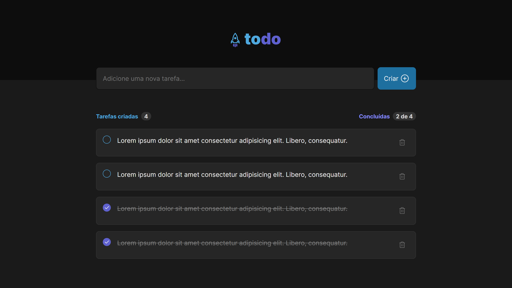

<p align="center">
  
</p>

<p align="center">
    <strong>Todo list Web Application</strong>
</p>

<p align="center">
 <a href="#-about">About</a> •
 <a href="#-features">Features</a> • 
 <a href="#-layout">Layout</a> • 
 <a href="#-technologies">Technologies</a> • 
 <a href="#-install">Install</a> • 
 <a href="#-license">License</a>
</p>

## 💻 About

The App was created to solve the challenge of Rocketseat's Ignite course (updated trail). This application, despite being simple, is an excellent example to practice the development of CRUD (Create, Read, Update, Delete).

<p align="center">
  
</p>


## ☑ Funcionalidades

- [x] Insert Tasks
  - [x] Inserting tasks with enter
  - [x] Check empty input
- [x] Change Task State
  - [x] Mark as concluded
  - [x] Delete task
- [x] Responsiveness


## 🎨 Layout

### Desktop

<p align="left"> 
  
</p>

### Mobile

<p align="left">       
  
  
</p>

## 🔨 Tecnologias utilizadas

The following tools were used to build the project:

- **[ReactJS](https://reactjs.org/)**
- **[TypeScript](https://www.typescriptlang.org/)**
- **[Sass](https://sass-lang.com/)**
- **[Vite](https://vitejs.dev/)**

> Veja o arquivo [package.json](https://github.com/mateusabelli/ignite-todo-app/blob/main/package.json)


## 🚀 Install

```bash
# Cloning repository
git clone https://github.com/mateusabelli/ignite-todo-app.git

# Access project's folder
cd ignite-todo-app

# Install dependencies
npm i

# Run application
npm run dev

```


## 📝 License

This project is under the MIT license. See the [LICENSE](./LICENSE.md) file for more details.

---

Made with 💜 by [Fernando Ghiberti](https://github.com/ghiberti85)